<div align="center">

# 브라우저 렌더링 — 강의에서 실측까지

**강의를 듣고 → 원본 영상과 대조하고 → 직접 측정해서 → 틀린 걸 찾아내고 → 움직이는 데모로 만든 기록**

`Chrome 152` · `CDP Tracing` · `LayerTree` · `memory-infra` · `Chromium 소스`

인터랙티브 데모 **10개** · 실험 **14개** · 사전 등록 주장 **44개**(21 성립 · 19 반증 · 4 부분·보류)

**내가 틀린 것 12개** · 폐기한 측정법 **6개**

### ▶ [**데모 10개 지금 바로 실행하기**](https://kasangyong.github.io/browser-rendering/demos/)

[](https://kasangyong.github.io/browser-rendering/demos/)
[](https://kasangyong.github.io/browser-rendering/report/)

설치 없이 브라우저에서 바로 열린다.

</div>

---

<div align="center">
  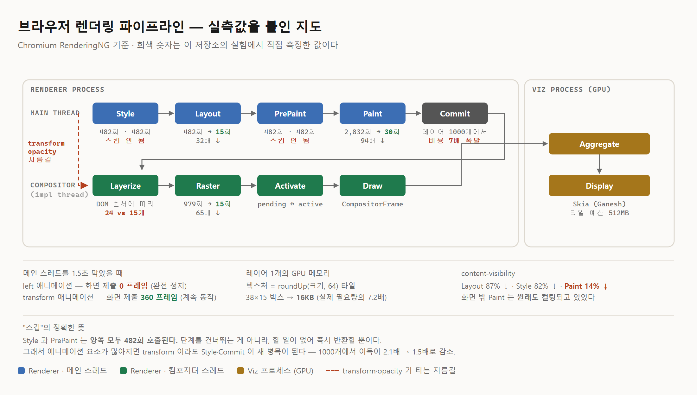
</div>

---

## 한 장면으로 보는 핵심

같은 애니메이션, 다른 CSS 속성. 램프가 **빨강일 때 메인 스레드는 JavaScript에 점유**돼 있다.

<div align="center">
  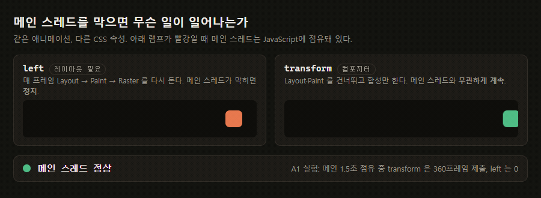
</div>

| | `left` | `transform` |
|---|---|---|
| 메인 1.5초 점유 중 **화면 제출** | **0 프레임** (완전 정지) | **360 프레임** (계속 동작) |
| `InvalidateLayout` 호출 | 497회 | **0회** |

> 이 GIF는 `Page.startScreencast` 로 녹화했다. `Page.captureScreenshot` 은 **메인 스레드에 걸려서** 블로킹 구간을 담지 못한다 —
> 그걸 모르고 처음엔 잘못된 결론을 낼 뻔했다. ([A1 §5](experiments/track-a/a1-pipeline-skip/RESULTS.md#5-도중에-버린-방법-두-가지-기록용))

---

## 목차

- [이 저장소는 무엇인가](#이-저장소는-무엇인가)
- [**인터랙티브 데모 10선**](#인터랙티브-데모-10선)
- [전체 결과 대시보드](#전체-결과-대시보드)
- [실험 — Track A 8개](#실험--track-a-8개)
  - [A1 · 파이프라인 단계 스킵](#a1--파이프라인-단계-스킵)
  - [A1b · transform 의 이득에는 천장이 있다](#a1b--transform-의-이득에는-천장이-있다)
  - [A2 · 합성 레이어의 GPU 메모리](#a2--합성-레이어의-gpu-메모리)
  - [A3 · DOM 순서만으로 레이어가 바뀐다](#a3--dom-순서만으로-레이어가-바뀐다)
  - [A4 · content-visibility 는 여전히 O(N)](#a4--content-visibility-는-여전히-on)
  - [A5 · INP 는 "결과가 보이는 시점"이 아니다](#a5--inp-는-결과가-보이는-시점이-아니다)
- [**Track C · 앞의 결론을 되짚는다**](#track-c--track-a-의-결론을-되짚는다)
  - [C1 · A4 의 결론은 절반만 맞았다](#c1--a4-의-결론은-절반만-맞았다)
  - [C2 · 같은 CSS 가 조건에 따라 손해를 본다](#c2--같은-css-가-조건에-따라-손해를-본다)
  - [C3 · "2,000 레이어 절벽" 은 측정 잡음이었다](#c3--2000-레이어-절벽-은-측정-잡음이었다)
  - [C4 · Raster 110배는 내가 정한 2초였다](#c4--raster-110배는-내가-정한-2초였다)
- [통용되는 말 vs 실측](#통용되는-말-vs-실측)
- [내가 틀렸던 것 12번](#내가-틀렸던-것-12번)
- [방법론 18조](#방법론-18조)
- [재현하기](#재현하기)
- [파일 구조](#파일-구조)
- [참고 자료](#참고-자료)

---

## 이 저장소는 무엇인가

브라우저 렌더링을 **읽고 끝내지 않고 직접 재본** 기록이다. 세 갈래로 진행했다.

```
① 조사      2026년 기술 지형 — 엔진별 현황 · GitHub 리포 · 1차 출처
   ↓
② 강의·영상  수강한 강의 정리(슬라이드 8장 매칭) + Life of a Pixel 원본 대조
   ↓
③ 실험      CDP 로 직접 계측 — 8개 실험, 사전 등록 예측, 반증 포함
```

| 단계 | 산출물 |
|---|---|
| 조사 | [2026 기술 지형](docs/01-landscape-2026.md) — Blink·WebKit·Gecko·Ladybird·Servo 현황, Skia Graphite, WebGPU, Interop 2026 |
| 강의 | [렌더링 파이프라인](docs/lecture/01-rendering-pipeline.md) · [JS와 렌더링](docs/lecture/02-javascript-and-rendering.md) |
| 영상 | [Life of a Pixel 분석](docs/video/01-life-of-a-pixel-2020.md) — 자막 전문 + 슬라이드 46장 판독 |
| 실험 | [Track A 종합](docs/03-track-a-synthesis.md) + `experiments/track-a/` |

### 영상 대조에서 나온 것

강의 정리 중 *"`paint → layer` 순서가 맞나?"* 라는 의문이 생겼고, [Life of a Pixel(2020)](https://www.youtube.com/watch?v=PwYxv-43iM4) 에서 **직접 증거**를 찾았다.

2020년 Chromium 은 실제로 `compositing update(layer) → prepaint → paint` 순서였고, 같은 발표에
**`composite after paint (CAP)` 가 "UNDER CONSTRUCTION"** 표지와 함께 등장한다. 캡션은 *"In the future, layers will be created after paint."*

| 시점 | 순서 |
|---|---|
| 2020 (영상) | layer → paint + **CAP 공사중** |
| 2026 (현재) | **paint → layer** (완료) |

6년에 걸쳐 실제로 뒤집힌 아키텍처를 양쪽에서 본 셈이다. → [상세](docs/video/01-life-of-a-pixel-2020.md#0-가장-중요한-발견--paint--layer-순서-문제가-풀렸다)

---

## 인터랙티브 데모 10선

**전부 움직이고 조작할 수 있다.** 의존성 없는 단일 HTML 파일이고, 표시되는 숫자는
아래 실험에서 **직접 측정한 값**이다. 각 데모 하단에 근거 실험 링크가 붙어 있다.

> ▶ **[지금 바로 열기](https://kasangyong.github.io/browser-rendering/demos/)** — 설치 없이 동작한다.
> 📂 소스는 [demos/](demos/) 에 있다. 받아서 `python -m http.server` 로 열어도 똑같다.

<div align="center">
  <a href="https://kasangyong.github.io/browser-rendering/demos/">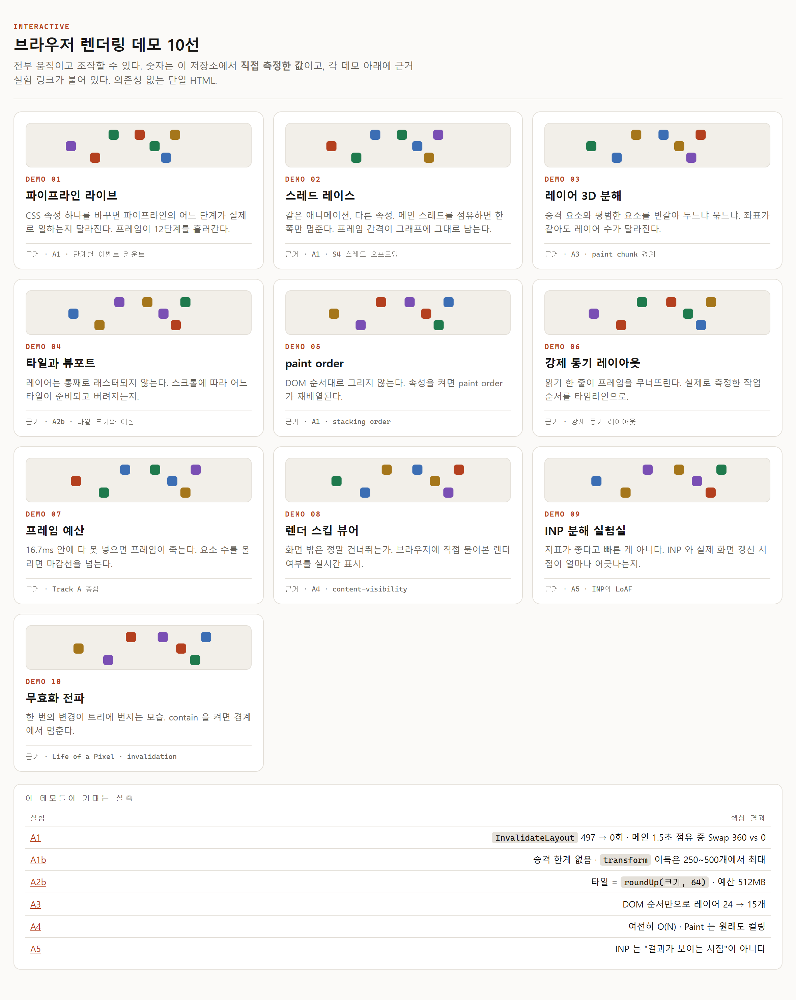</a>
</div>

### 움직이는 것들

<table>
<tr>
<td width="50%" valign="top">

**[01 · 파이프라인 라이브](https://kasangyong.github.io/browser-rendering/demos/01-pipeline/)** ▶
CSS 속성을 바꾸면 **어느 단계가 실제로 일하는지** 달라진다.
테두리가 켜진 단계 = 일하는 단계, 흐린 단계 = 호출되지만 할 일 없음.

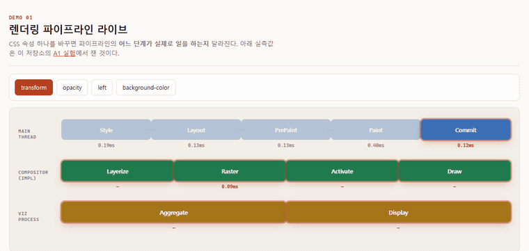

</td>
<td width="50%" valign="top">

**[02 · 스레드 레이스](https://kasangyong.github.io/browser-rendering/demos/02-thread-race/)** ▶
메인 스레드를 점유하면 `left` 는 멈추고 `transform` 은 계속 간다.
아래 스트립차트는 **실제 프레임 간격** — 막힌 구간이 봉우리로 남는다.

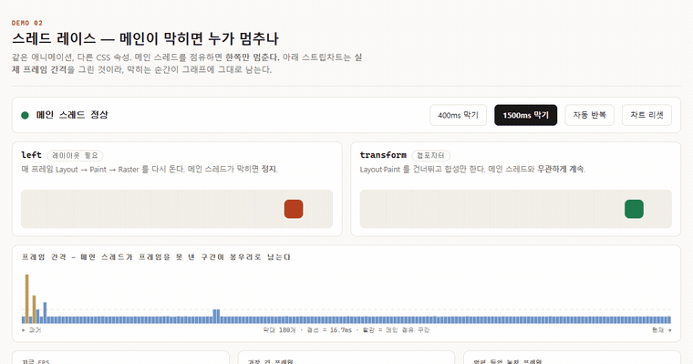

</td>
</tr>
<tr>
<td width="50%" valign="top">

**[03 · 레이어 3D 분해](https://kasangyong.github.io/browser-rendering/demos/03-layers-3d/)** ▶
DOM 순서만 바꾸면 레이어가 **24개 → 15개**로 갈라졌다 합쳐진다.
초록 = 승격된 레이어, 파랑 = `Overlap` 때문에 생긴 레이어.

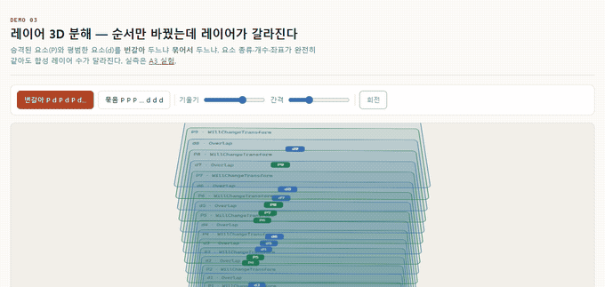

</td>
<td width="50%" valign="top">

**[04 · 타일과 뷰포트](https://kasangyong.github.io/browser-rendering/demos/04-tiles/)** ▶
레이어는 통째로 래스터되지 않는다. 스크롤에 따라
초록(래스터됨) → 주황(선행) → 회색(버림) 으로 바뀐다.

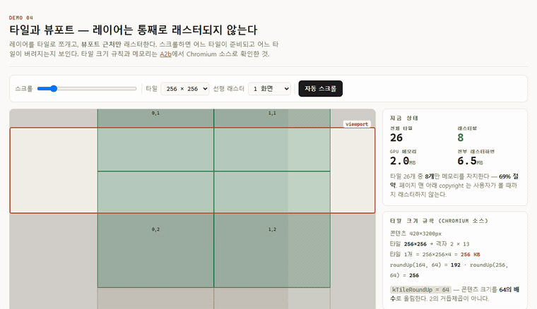

</td>
</tr>
</table>

### 나머지 6개

| 데모 | 무엇을 보여주나 | 근거 |
|---|---|---|
| [**05 · paint order**](https://kasangyong.github.io/browser-rendering/demos/05-paint-order/) | 요소를 고르고 `z-index`·`opacity`·`transform` 을 켜면 **그리는 순서가 재배열**된다. paint phase 4단계 순회도 애니메이션으로 | A1 |
| [**06 · 강제 동기 레이아웃**](https://kasangyong.github.io/browser-rendering/demos/06-thrash/) | 읽기·쓰기를 번갈아 하면 매번 레이아웃이 강제된다. **실제로 측정한** 작업 순서를 타임라인으로 | — |
| [**07 · 프레임 예산**](https://kasangyong.github.io/browser-rendering/demos/07-frame-budget/) | 요소 수를 올리면 막대가 **마감선을 넘고** 프레임이 죽는다. 단계별 비용은 Track A 실측값 | A1·A1b·A4 |
| [**08 · 렌더 스킵 뷰어**](https://kasangyong.github.io/browser-rendering/demos/08-render-skip/) | 화면 밖 항목이 정말 건너뛰어지는지 **브라우저에 직접 물어본다**(`checkVisibility`) | A4 |
| [**09 · INP 분해 실험실**](https://kasangyong.github.io/browser-rendering/demos/09-inp-lab/) | 클릭하면 input delay / processing / presentation 이 막대로 쌓인다. **INP 와 실제 화면 갱신의 간극**이 핵심 | A5 |
| [**10 · 무효화 전파**](https://kasangyong.github.io/browser-rendering/demos/10-invalidation/) | 노드를 누르면 재계산이 트리에 번진다. `contain` 을 켜면 **경계에서 멈춘다** | Life of a Pixel |

<div align="center">
  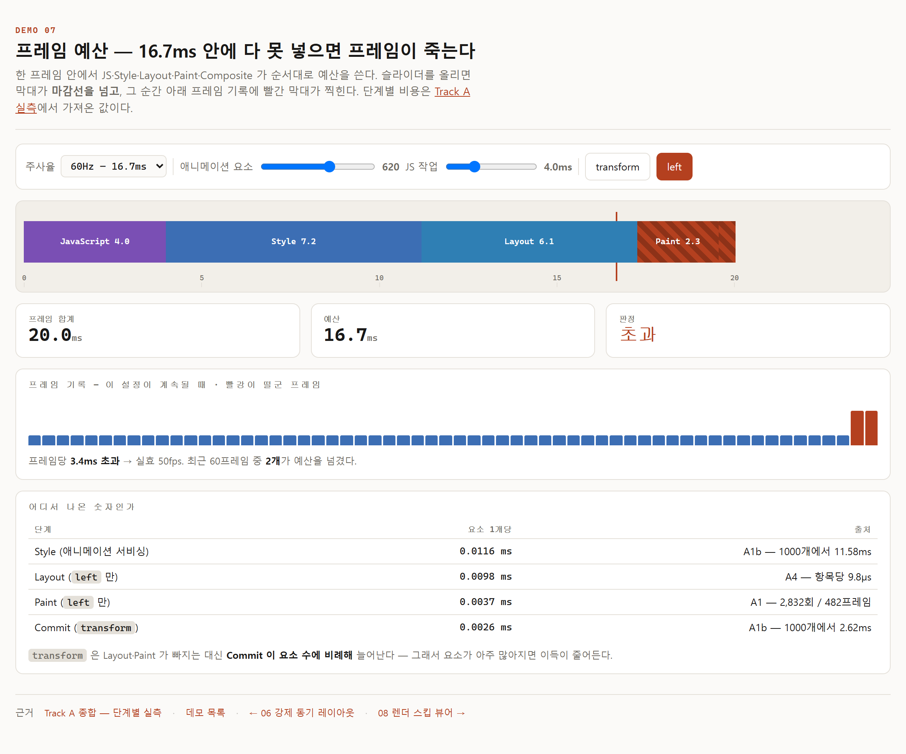
  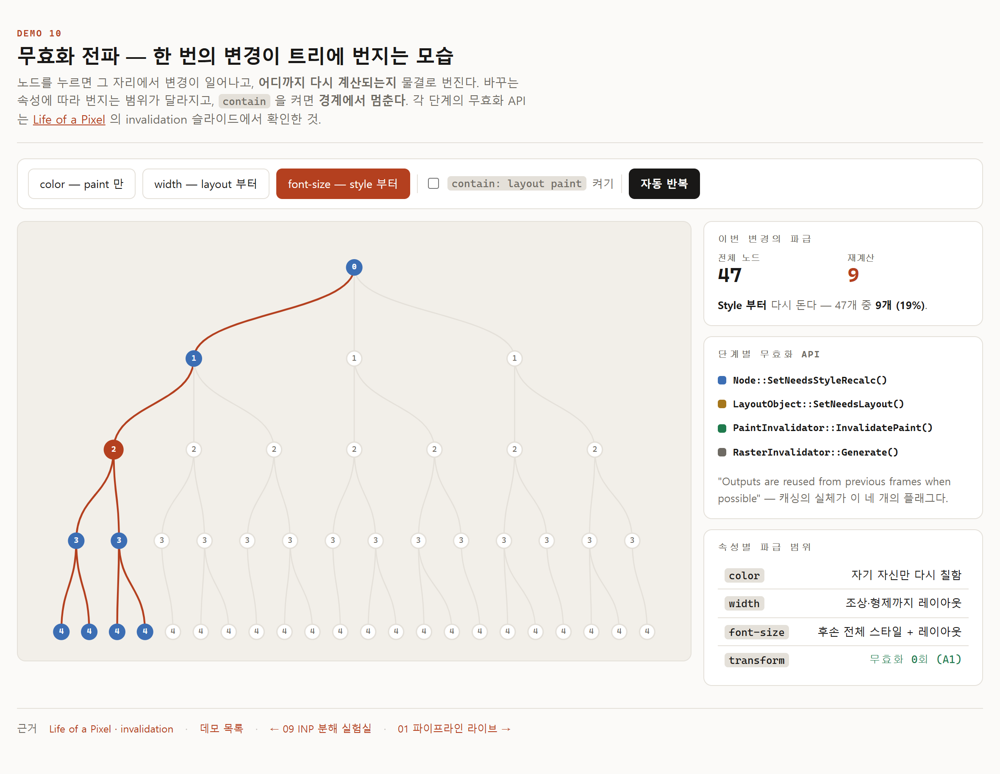
</div>

<details>
<summary><b>데모 5~9 스크린샷 펼치기</b></summary>

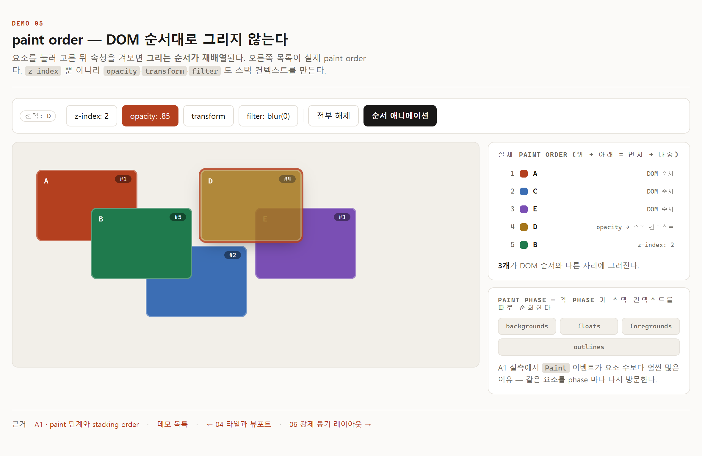
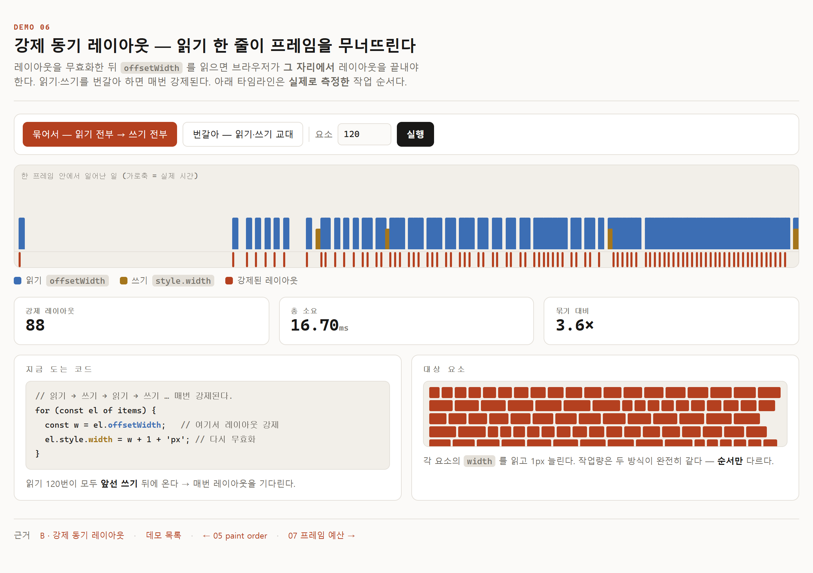
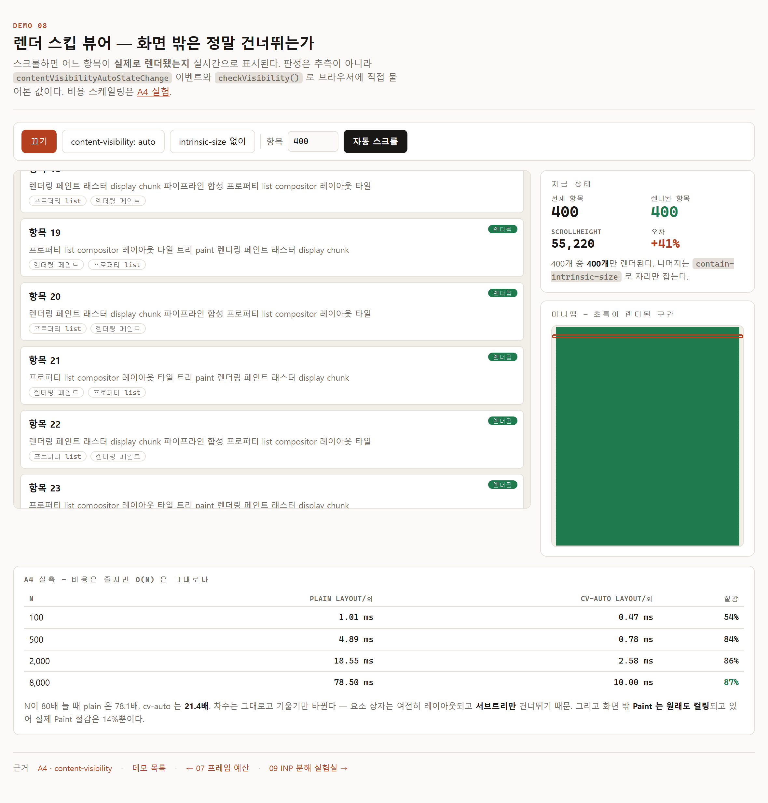
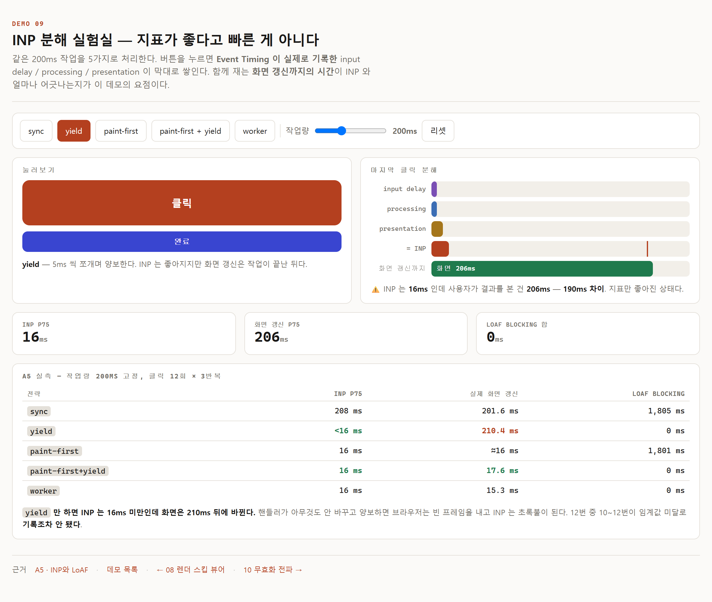

</details>

> **데모가 실측에 기대는 방식** — 애니메이션은 설명을 위한 모형이지만,
> 표시되는 **숫자는 전부 이 저장소의 측정값**이다. 예를 들어 07의 "요소 1개당 Style 0.0116ms" 는
> [A1b](experiments/track-a/a1-pipeline-skip/RESULTS-b.md) 에서 1000개 기준 11.58ms 를 잰 값이고,
> 08의 렌더 여부는 추측이 아니라 `checkVisibility({contentVisibilityAuto:true})` 로 브라우저에 물어본 결과다.

---

## 전체 결과 대시보드

숫자는 [`report/build-report.mjs`](report/build-report.mjs) 가 원자료 JSON에서 **직접 계산**한다. 손으로 옮긴 값이 없다.

<div align="center">
  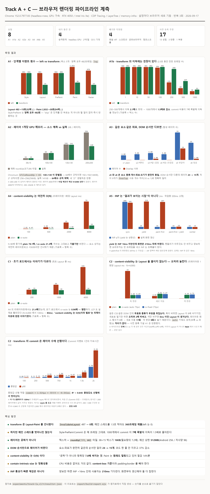
</div>

---

## 실험 — Track A 8개

모든 실험은 **측정 전에 예측을 파일로 등록**하고(`PREDICTION.md`), 설정마다 Chrome 을 새로 띄우고, 3회 반복했다.

| | 실험 | 핵심 결과 | 판정 |
|---|---|---|:---:|
| A1 | [파이프라인 단계 스킵](experiments/track-a/a1-pipeline-skip/RESULTS.md) | `InvalidateLayout` 497 → **0회** | 보통 |
| A1b | [박스 개수 스윕](experiments/track-a/a1-pipeline-skip/RESULTS-b.md) | 승격 한계 **없음**, 이득에 **천장** | 통과 |
| A2 | [합성 레이어 GPU 메모리](experiments/track-a/a2-gpu-memory/RESULTS.md) | 레이어당 16KB, 상한 512MB | 통과 |
| A2b | [Chromium 소스 검증](experiments/track-a/a2-gpu-memory/RESULTS-source.md) | **내 경험칙 반증** | 통과 |
| A3 | [paint chunk 경계](experiments/track-a/a3-paint-chunks/RESULTS.md) | DOM 순서로 레이어 **24 → 15** | 통과 |
| A4 | [content-visibility 스케일링](experiments/track-a/a4-content-visibility/RESULTS.md) | **여전히 O(N)** | 통과 |
| A4b | [content-visibility 의 대가](experiments/track-a/a4-content-visibility/RESULTS-scroll.md) | 총량 7.4배, 그러나 **분산됨** | 통과 |
| A5 | [INP ↔ LoAF](experiments/track-a/a5-inp-loaf/RESULTS.md) | INP ≠ 체감 | 통과 |

---

### A1 · 파이프라인 단계 스킵

> **질문** — `transform` 애니메이션은 정말 Layout·Paint 를 건너뛰는가?

박스 5개로 줄이자 세 모드 모두 **정확히 같은 482프레임**을 냈다. 프레임 수가 같으니 이벤트 수를 그대로 비교할 수 있다.

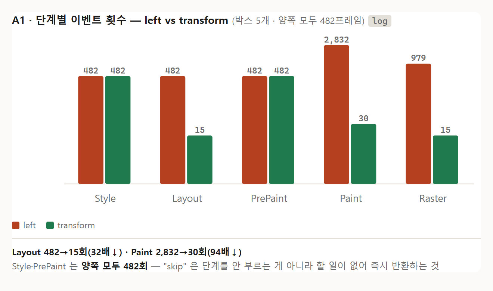

| 단계 | `left` | `transform` | 배율 |
|---|---:|---:|---:|
| `UpdateLayoutTree` (Style) | 482회 | 482회 | **1× 동일** |
| `Layout` | 482회 | **15회** | **32×** |
| `PrePaint` | 482회 | 482회 | **1× 동일** |
| `Paint` | 2,832회 | **30회** | **94×** |
| `RasterTask` | 979회 | **15회** | **65×** |
| **`InvalidateLayout`** | **497회** | **0회** | **∞** |

`InvalidateLayout` 497 → 0 이 가장 깨끗한 증거다. 영상의 invalidation 슬라이드에 나온 `LayoutObject::SetNeedsLayout()` 이 바로 이 이벤트다.

#### 📌 예상과 달랐던 것 — "skip"의 정확한 뜻

문서는 *"animations can skip layout, pre-paint and paint"* 라고 쓰지만, 실측에서 **`PrePaint` 는 양쪽 모두 482회** 돌았다.

**단계를 호출하지 않는 게 아니라, 할 일이 없어 즉시 반환한다.** 비용은 0.13ms/프레임으로 무시할 만하지만, 이 구분이 A1b의 결과를 설명한다.

<details>
<summary><b>계측 하네스</b> (클릭)</summary>

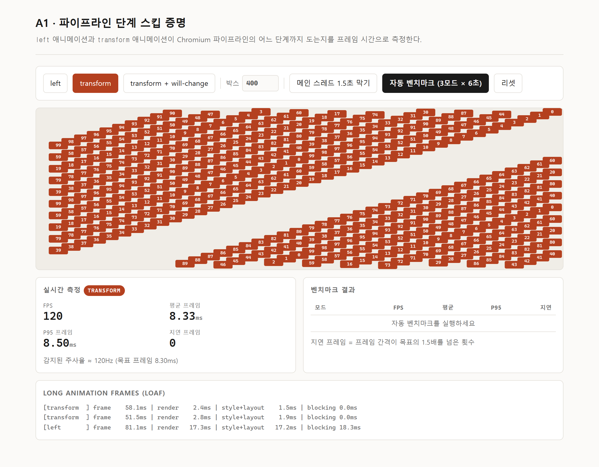

의존성 없는 단일 HTML. 주사율 자동 감지, 커버리지 검사(브라우저 창이 가려져 rAF 가 멈추면 **측정 무효** 표시), LoAF 관찰자 내장.
</details>

---

### A1b · transform 의 이득에는 천장이 있다

> **질문** — 몇 개부터 레이어 승격이 거부되는가?

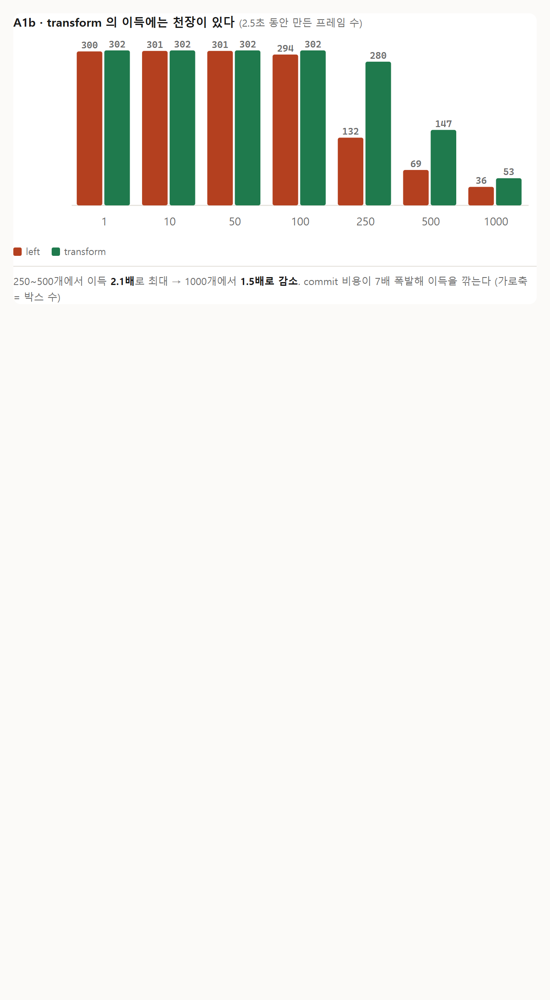

**답: 거부되지 않는다.** 8000개 요소 → 8005 레이어. 내 가설이 틀렸다.

대신 다른 게 나왔다. **이득이 250~500개에서 최대 2.1배를 찍고 1000개에서 1.5배로 줄어든다.**

| 프레임당 비용 | `none` | `left` | `transform` |
|---|---:|---:|---:|
| Style recalc (1000개) | **0.004ms** | 11.58ms | 14.95ms |
| **`Commit`** (1000개) | 0.107ms | 0.372ms | **2.616ms** |

- `none`(애니메이션 없음)은 1000개여도 0.004ms → **style 비용은 DOM 크기가 아니라 애니메이션 개수에 비례**
- 1000개에서 `transform` 의 commit 이 **7배 폭발** — 레이어 1006개와 property tree 를 매 프레임 스레드 경계 너머로 복사해야 하니까

> **`transform` 은 Layout·Paint 를 없앨 뿐, 메인 스레드에서 완전히 벗어나는 게 아니다.**

---

### A2 · 합성 레이어의 GPU 메모리

> **질문** — 레이어 하나가 GPU 메모리를 얼마나 먹는가?

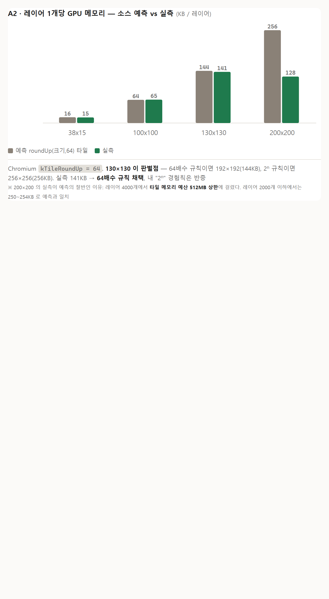

**텍스처는 실제 크기가 아니라 `roundUp(콘텐츠 크기, 64)` 타일로 올림된다.**

| 박스 크기 | 실제 픽셀 | 타일 | 레이어당 | 오버헤드 |
|---|---:|---|---:|---:|
| 38×15 | 2.23 KB | 64×64 | **16 KB** | **7.2×** |
| 100×100 | 39.1 KB | 128×128 | **64 KB** | 1.64× |
| 130×130 | 66.0 KB | 192×192 | **144 KB** | 2.2× |
| 200×200 | 156.3 KB | 256×256 | **256 KB** | 1.64× |

#### 📌 여기서 내가 틀렸다 — 그리고 어떻게 알았나

처음엔 "**2의 거듭제곱** 정사각 타일"이라고 결론냈다. 38×15 → 64, 100×100 → 128, 200×200 → 256. 세 개 다 맞았으니까.

Chromium 소스를 열어보니 실제 규칙은 달랐다.

```cpp
// cc/layers/tile_size_calculator.cc
const int kTileRoundUp = 64;

if (content_bounds.width() < default_tile_width) {
  tile_width = MathUtil::UncheckedRoundUp(content_bounds.width(), kTileRoundUp);
  tile_width = std::min(tile_width, default_tile_width);
}
```

**64의 배수로 올림**이다. 내가 고른 세 크기가 하필 **두 규칙의 답이 같아지는 값**이었던 것.

| 크기 | 64배수 | 2ⁿ | 구분 |
|---|---|---|:---:|
| 38×15 · 100×100 · 200×200 | 64 / 128 / 256 | 64 / 128 / 256 | ❌ |
| **130×130** | **192×192 = 144KB** | 256×256 = 256KB | ✅ |

판별 실험(레이어 1000개, 3회) 결과 **140.3 KB/레이어** → 예측 144KB의 **97.4%**. H1(64배수) 채택.

> *데이터가 가설을 지지한 것*과 *데이터가 가설을 반박할 능력이 없는 것*은 다르다. → [A2b 전문](experiments/track-a/a2-gpu-memory/RESULTS-source.md)

#### 타일 메모리 상한도 소스에서 확인

```cpp
// third_party/blink/renderer/platform/widget/compositing/layer_tree_settings.cc
static constexpr size_t kDefaultMemoryMB = 512;
```

| 플랫폼 | 예산 |
|---|---|
| 데스크톱 | **512 MB** (하한) |
| Android 일반 | **256 MB** |
| Android 저사양(<2GB) | **96 MB** |

레이어 4006개를 만들어도 **메모리는 501MB에서 멈춘다.** 승격은 계속하면서 타일은 안 준다 — 에러도 경고도 없이 조용히 나빠진다.

---

### A3 · DOM 순서만으로 레이어가 바뀐다

> **질문** — paint chunk 는 *연속된* 항목의 묶음이라는데, 순서가 정말 결과를 바꾸는가?

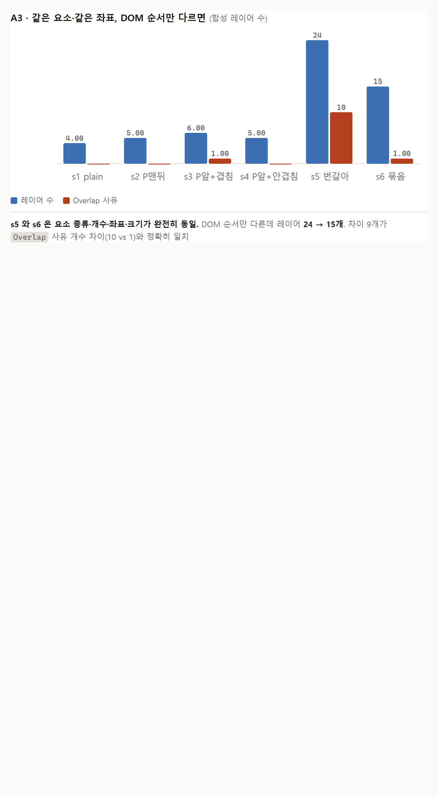

**s5 와 s6 은 요소 종류·개수·좌표·크기가 완전히 동일하다. DOM 순서만 다르다.**

| 시나리오 | DOM 순서 | 레이어 | `Overlap` 사유 |
|---|---|---:|---:|
| s5 `interleaved` | `PdPdPdPd…` | **24** | **10** |
| s6 `grouped` | `PPPPP…ddddd…` | **15** | **1** |

```
s5 = 4(기본) + 10(WillChangeTransform) + 10(Overlap) = 24 ✓
s6 = 4(기본) + 10(WillChangeTransform) +  1(Overlap) = 15 ✓
```

레이어 차이 9개가 **`Overlap` 사유 개수 차이와 정확히 일치**한다. 3회 반복 전부 동일 — 레이어화는 결정론적이다.

**왜**: `d₁`은 `P₀` 위, `P₂` 아래에 와야 한다. 아래로 병합 불가, 다른 `d`와 합치기도 불가(사이에 `P₂`가 낌) → 자기 레이어를 가질 수밖에 없다. 반면 `d` 10개가 **연속**이면 하나의 squashing 레이어로 묶인다.

> **코드 한 줄 안 지우고 레이어 37% 감소.** 애니메이션 요소를 DOM에서 한쪽으로 모으기만 하면 된다.

<details>
<summary><b>계측 하네스</b> — 시나리오 6종 (클릭)</summary>

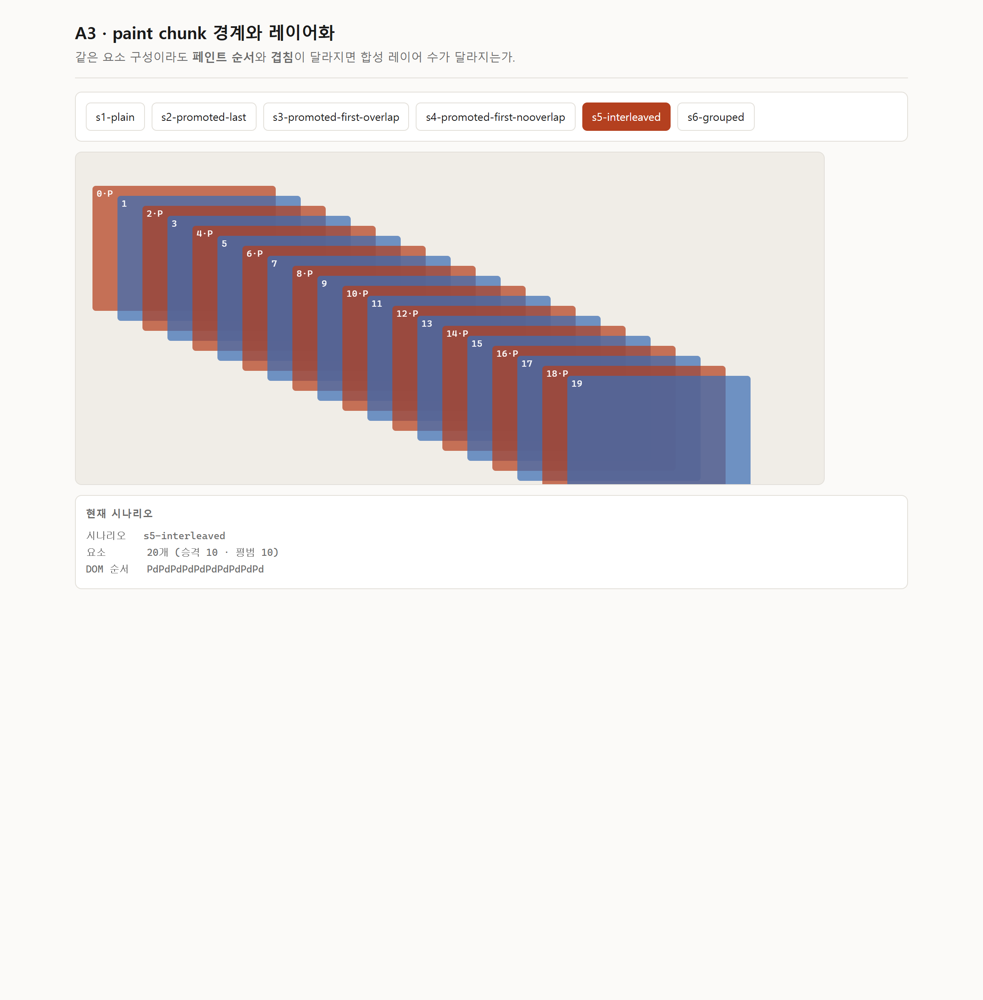
</details>

---

### A4 · content-visibility 는 여전히 O(N)

> **질문** — 화면 밖 콘텐츠가 정말 "공짜"가 되는가?

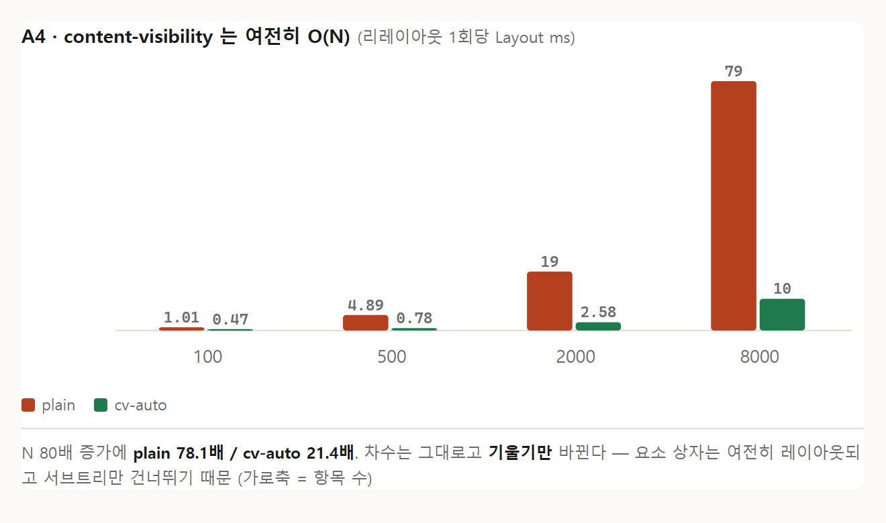

**내 예측(N과 무관해진다)은 반증됐다.**

| Layout 시간, N=100 → 8000 (80배) | 예측 | 실측 |
|---|---:|---:|
| `plain` | ≥40배 | **78.1배** ✅ |
| `cv-auto` | **<5배** | **21.4배** ❌ |

바뀌는 건 **기울기지 차수가 아니다.** 항목당 9.8µs → 1.25µs (7.8배)로 줄 뿐, 항목 수에는 그대로 비례한다.
`content-visibility: auto` 는 각 요소의 **서브트리**를 건너뛰지만 **상자 자체는 여전히 레이아웃**된다.

#### 📌 더 뜻밖이었던 것 — Paint 는 원래도 안 하고 있었다

| N 배율 (100→8000) | Paint |
|---|---:|
| `plain` | **5.4배** |
| `cv-auto` | 5.5배 |

`plain` **조차** Paint 가 N에 비례하지 않는다. Chromium 은 `content-visibility` 없이도 **화면 밖 페인트를 이미 컬링**한다.

| 단계 | 실제 절감 |
|---|---:|
| Layout | **87%** |
| Style | **82%** |
| PrePaint | **74%** |
| **Paint** | **14%** |

"layout **and paint** 를 건너뛴다"는 흔한 설명은 이 조건에선 절반만 맞다.

#### contain-intrinsic-size 는 속도가 아니라 정확성용

| 모드 | Layout (N=8000) | `scrollHeight` |
|---|---:|---:|
| `plain` (진짜) | 78.50ms | 872,328px |
| `cv-auto` (118px) | 10.00ms | 1,231,608px (**+41%**) |
| `cv-nosize` (미지정) | 10.88ms | 291,832px (**−67%**) |

CPU 비용은 사실상 같다. 차이는 전부 스크롤 길이에 있다. 그리고 41% 오차를 파고들다 함정을 찾았다.

```
cv-auto 추정 153.95px = 지정값 118 + padding 24 + border 2 + margin 10 ✓
```

**`contain-intrinsic-size` 는 content-box 크기다.** "항목이 대충 118px이니 118 넣자"가 틀린 이유고, 넣었어야 할 값은 **73px** 이었다.

#### A4b · 미뤄둔 일은 사라지지 않는다

| N=8000, 스크롤 중 | `Layout` |
|---|---:|
| `plain` | **정확히 0ms** |
| `cv-auto` | **584ms** |

전체 스크롤 누적이 `plain` 1회 리레이아웃의 **7.4배**. 하지만 총량이 아니라 **분포**가 핵심이다.

| | `plain` | `cv-exact` |
|---|---|---|
| 구축·리레이아웃 | **78.5ms 한 방** (프레임 4~5개 날아감) | ~10ms |
| 스크롤 중 | 0ms | 401ms를 **60프레임에 분산 = 6.7ms/프레임** |
| 체감 | 한 번 크게 멈춤 | 멈춤 없음 (예산 16.7ms 안) |

> **총 작업량을 줄이는 기능이 아니라, 큰 정지를 잘게 나누는 기능이다.**

⚠️ **스크롤 패턴이 결론을 뒤집었다.** 1차 측정은 21,786px 씩 점프했는데 그건 스크롤이 아니라 순간이동이다.
점프형에선 정확한 `contain-intrinsic-size` 가 1.9배 **나빴고**, 연속형(300px×60)에선 1.78배 **좋았다**.
점프형 결과를 그대로 보고했다면 *"정확한 값은 오히려 해롭다"* 는 틀린 조언을 남겼을 것이다.

<details>
<summary><b>계측 하네스</b> (클릭)</summary>

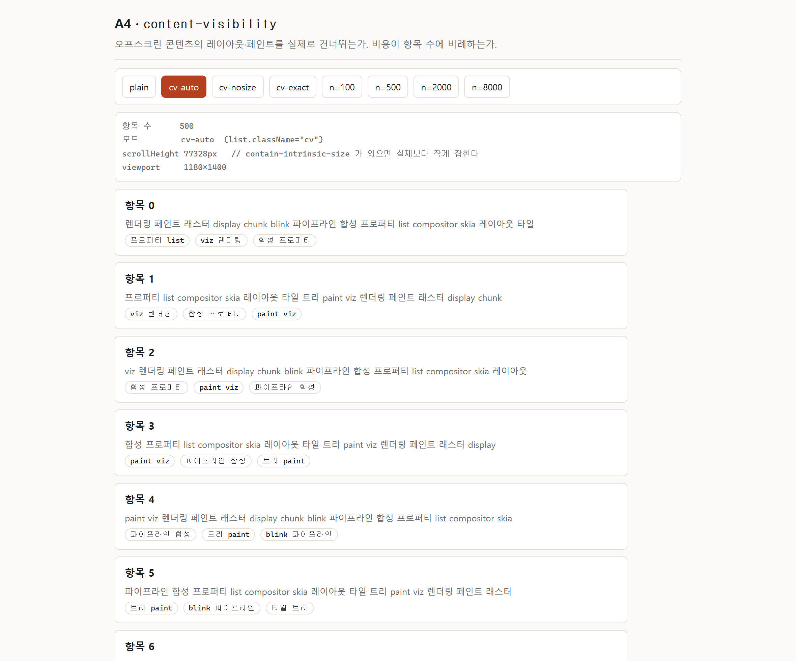
</details>

---

### A5 · INP 는 "결과가 보이는 시점"이 아니다

> **질문** — 같은 200ms 작업을 어떻게 처리하느냐에 따라 INP 가 얼마나 달라지는가?

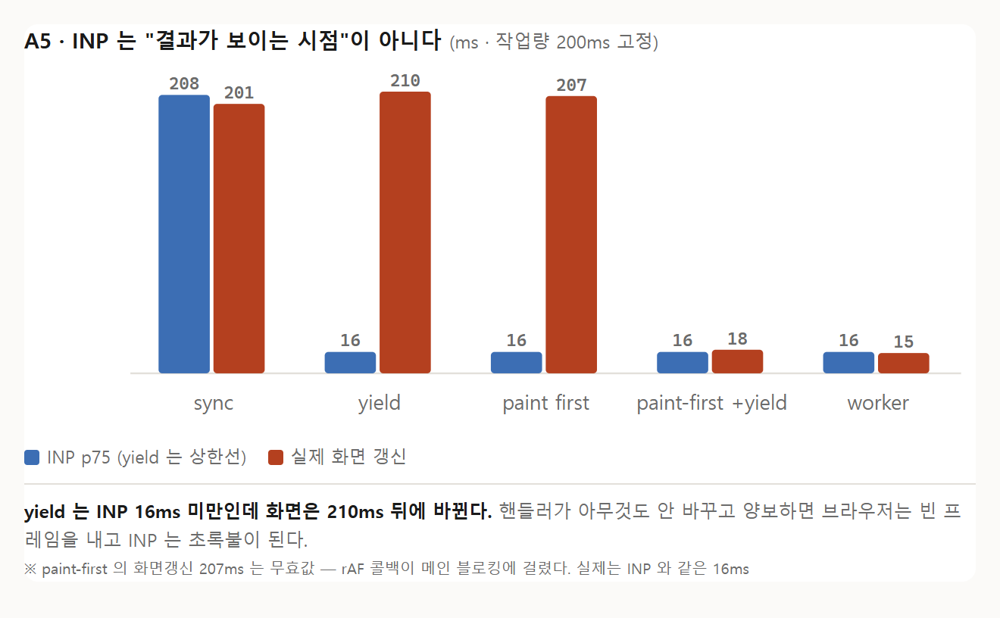

| 전략 | INP p75 | **실제 화면 갱신** | LoAF blocking |
|---|---:|---:|---:|
| `sync` | 208ms | 201.6ms | 1,805ms |
| `yield` | **<16ms** | **210.4ms** | **0ms** |
| `paint-first` | 16ms | (측정 무효)¹ | 1,801ms |
| **`paint-first+yield`** | **16ms** | **17.6ms** | **0ms** |
| `worker` | 16ms | 15.3ms | **0ms** |

**`yield` 만 하면 INP 는 거의 완벽해지는데 사용자는 여전히 210ms 기다린다.**

INP 는 "입력 → **다음 프레임**"을 잰다. **그 프레임에 내 작업 결과가 들어있는지는 보지 않는다.**
핸들러가 아무것도 안 바꾸고 양보하면 브라우저는 빈 프레임을 내고 INP 는 초록불이 된다.
12번 클릭 중 10~12번이 16ms 임계값 미달로 **기록조차 안 됐다**.

> INP 200ms 기준 통과가 곧 빠른 체감은 아니다. 양보만으로 지표를 좋아 보이게 만들 수 있다.

¹ `paint-first` 의 화면 갱신 207ms 는 **거짓값**이다. 내 `rAF` 콜백도 메인 스레드에서 도는데 `busy(200)` 이 막고 있어서
"픽셀 시점"이 아니라 "메인이 한가해진 시점"을 쟀다. 나중에 추가한 `paint-first+yield`(메인이 안 막힘)가 **17.6ms** 를 보여줘 걸러냈다.
→ **A1에서 스크린샷으로 당한 것과 같은 함정을 두 번째로 만난 것.**

**권장 순서**: 워커로 옮길 수 있으면 워커 → 못 옮기면 **화면부터 갱신 + 시간 분할 양보** → 양보만 하는 건 지표만 고친다.

<details>
<summary><b>계측 하네스</b> (클릭)</summary>

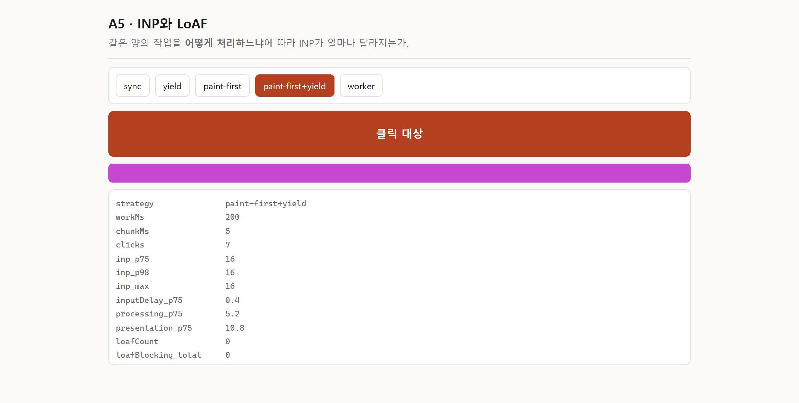
</details>

---

## Track C — Track A 의 결론을 되짚는다

Track A 를 끝내고 나서도 **설명 못 한 채로 닫은 것**이 남아 있었다.
Track C 는 새 주제를 여는 게 아니라 **앞의 결론이 어디까지 참인지 범위를 좁히는** 트랙이다.

---

### C1 · A4 의 결론은 절반만 맞았다

> **질문** — `content-visibility` 가 광고하는 건 **초기 로드**인데, 나는 **리레이아웃**만 쟀다. 초기 로드는 어떤가?

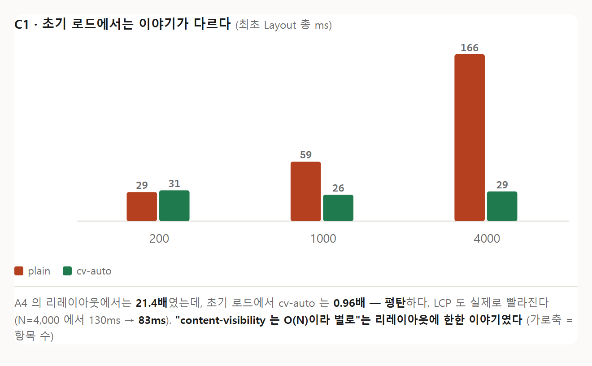

A4 에서 나는 **"`content-visibility` 는 여전히 O(N)"** 이라고 결론냈다.
그 문장을 그대로 남겨두면 **틀린 조언**이 된다.

| Layout 스케일링 | 리레이아웃 (A4) | **초기 로드 (C1)** |
|---|---:|---:|
| `plain` | 78.1배 (N 80배) | 5.74배 (N 20배) |
| `cv-auto` | **21.4배** | **0.96배 — 평탄** |

항목을 **HTML 에 미리 박아둔 정적 파일**(최대 959KB)을 내비게이션해서,
트레이싱을 **켜둔 채로** 파싱부터 LCP 까지 담았다. JS 로 DOM 을 만들었다면
파싱 비용이 빠져서 A4 와 같은 측정을 반복했을 뿐이다.

**LCP 도 실제로 빨라진다 — 이것도 내 예측이 틀렸다.**

| N | `plain` | `cv-auto` | 단축 |
|---:|---:|---:|---:|
| 200 | 94 ms | 73 ms | 22% |
| 1,000 | 108 ms | 66 ms | **39%** |
| 4,000 | 130 ms | 83 ms | **36%** |

예측할 때 *"LCP 요소는 화면 맨 위라 모드와 무관할 것"* 이라고 적었다. 이유는 단순했다 —
**레이아웃이 끝나야 첫 페인트가 나온다.** `plain` 은 화면 밖 3,990개까지 전부 배치한 뒤에야
첫 화면을 그릴 수 있고, 그 166ms 가 LCP 를 그대로 밀어낸다.

> ⚠️ **"O(1) 이 됐다"고는 말하지 않는다.** N개 상자의 위치는 이론상 여전히 계산해야 한다.
> 정확한 서술은 **항목당 비용이 `plain` 의 1/100 이하로 떨어져 측정 한계(±3ms) 아래로 내려갔다**는 것이다.

**`contain-intrinsic-size: 73px` 이 세 번째로 교차 검증됐다** — N=4,000 에서 `scrollHeight`
436,074px vs 진짜 441,611px, 오차 **−1.3%**. 값을 안 주면 문서가 **1/3 로 쪼그라든다**(−66%).

<sub>사전 등록 [PREDICTION.md](experiments/track-c/c1-initial-load/PREDICTION.md) · 전체 결과 [RESULTS.md](experiments/track-c/c1-initial-load/RESULTS.md) — 주장 5개 중 **2개 반증 · 2개 조건부**</sub>

---

### C2 · 같은 CSS 가 조건에 따라 손해를 본다

> **질문** — Track A 를 끝내고도 *설명 못 한 채로 닫은* 이상치 세 개가 남았다. 판별한다.

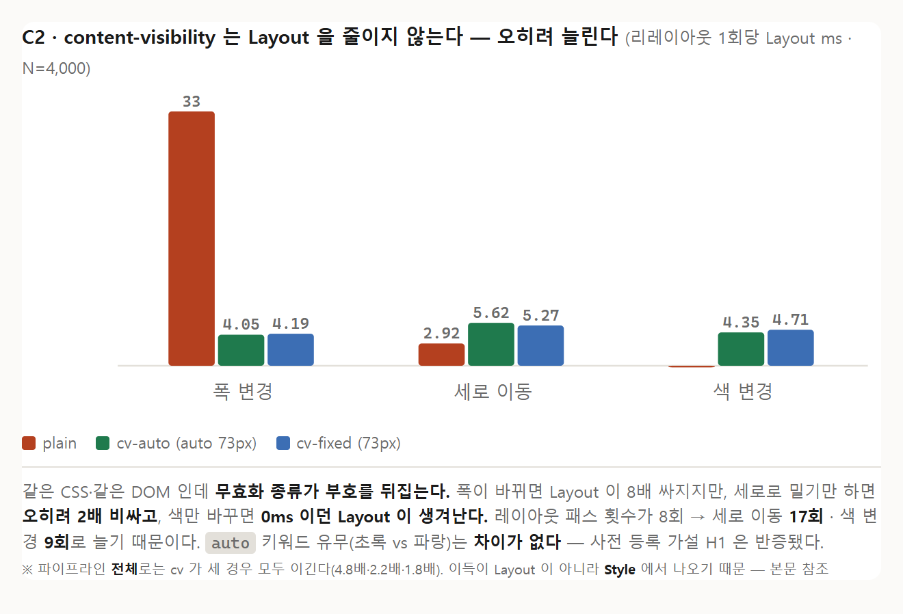

사전 등록한 가설 셋 중 **둘을 틀렸고, 예측하지 않은 걸 하나 찾았다.**

#### 예측 못 한 것 — `content-visibility` 는 Layout 을 **늘린다**

`auto` 키워드가 원인인지 보려고 **모드 3 × 무효화 3 × N 2** 완전 격자를 돌렸더니,
정작 눈에 띈 건 시간이 아니라 **레이아웃 패스 횟수**였다. (N=4,000, 무효화 8회)

| 무엇을 바꿨나 | Layout 패스 `plain` → `cv` | Layout ms | Style ms |
|---|---|---|---|
| 컨테이너 **폭** (A4 가 쓴 방법) | 8 → 9회 | 265.9 → **32.4** (−88%) | 222.4 → 54.3 (−76%) |
| **세로 위치**만 (`padding-top`) | 8 → **17회** | 23.4 → **45.0 (+92%)** | 226.4 → 65.5 (−71%) |
| **색**만 (레이아웃 무관) | **0 → 9회** | 0.0 → **34.8** | 221.9 → 58.3 (−74%) |

- **세로로 밀기만 해도** 레이아웃을 **두 번** 돈다. 배치 → 뷰포트 근접 재판정 → 또 배치.
- **색만 바꿔도** 없던 레이아웃이 9번 생긴다. `plain` 은 **0번**이다.

그런데 파이프라인 **전체**로는 세 경우 모두 `cv` 가 이긴다(4.83 / 2.18 / 1.75배).
**이득이 Layout 이 아니라 Style 에서 나오기 때문이다** — Style 절감은 무효화 종류와 무관하게 −71~76% 로 일정하다.

> A4 에서 내세운 *"Layout 87% 절감"* 은 **폭 변경이라는 한 가지 조건에서만** 성립한다.
> 무효화 종류를 바꾸면 Layout 절감은 사라지거나 역전되고, 끝까지 남는 건 **Style 절감**이다.

#### `auto` 키워드는 범인이 아니었다

| 무효화 | `auto 73px` | `73px` (auto 제거) | 차이 |
|---|---:|---:|---:|
| 폭 | 32.4ms | 33.5ms | 3% |
| 세로 | 45.0ms | 42.1ms | 6% |
| 색 | 34.8ms | 37.7ms | 8% |

전부 반복 편차(±20%)보다 작다. 두 번 독립 실행해도 같았다. **C1 에서 세운 가설은 틀렸다.**

#### 파고들다 발견한 것 — 이 화면은 120Hz 고, 그래서 A1b 의 숫자 하나가 못 쓰는 값이다

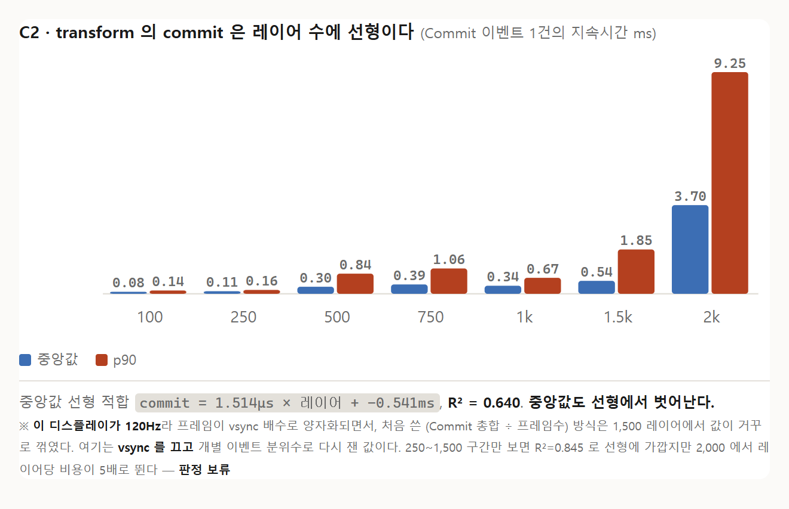

rAF 프레임 간격을 직접 재보니 **정확히 8.3ms(=120Hz)** 였고, 간격이 8.3의 **배수로 양자화**된다(8.3 → 16.3 → 39.9).

A1b 는 프레임당 commit 비용을 `총합 ÷ 프레임 수` 로 구했다. 그 분모가 양자화되니
**레이어 수가 아니라 양자화 계단을 잰 셈**이다. 같은 방식으로 다시 재니 1,500 레이어에서
값이 **거꾸로 꺾였다**(프레임이 107 → 154로 *늘었다*).

> **A1b 의 "commit 1,000개에서 7.0배 폭발"은 인용하면 안 되는 숫자다.**
> 방향(레이어가 늘면 commit 이 비싸진다)은 맞지만 배율은 못 믿는다.
> vsync 를 끄고 다시 재도 R² 0.64 — **③ 은 판정 보류**로 남겼다.

<sub>사전 등록 [PREDICTION.md](experiments/track-c/c2-anomalies/PREDICTION.md) · 전체 결과 [RESULTS.md](experiments/track-c/c2-anomalies/RESULTS.md)</sub>

---

### C3 · "2,000 레이어 절벽" 은 측정 잡음이었다

> **질문** — C2 에서 *"2,000 레이어 근처에 뭔가 있다"* 고 미검증 가설로 남겨뒀다. 진짜인가?

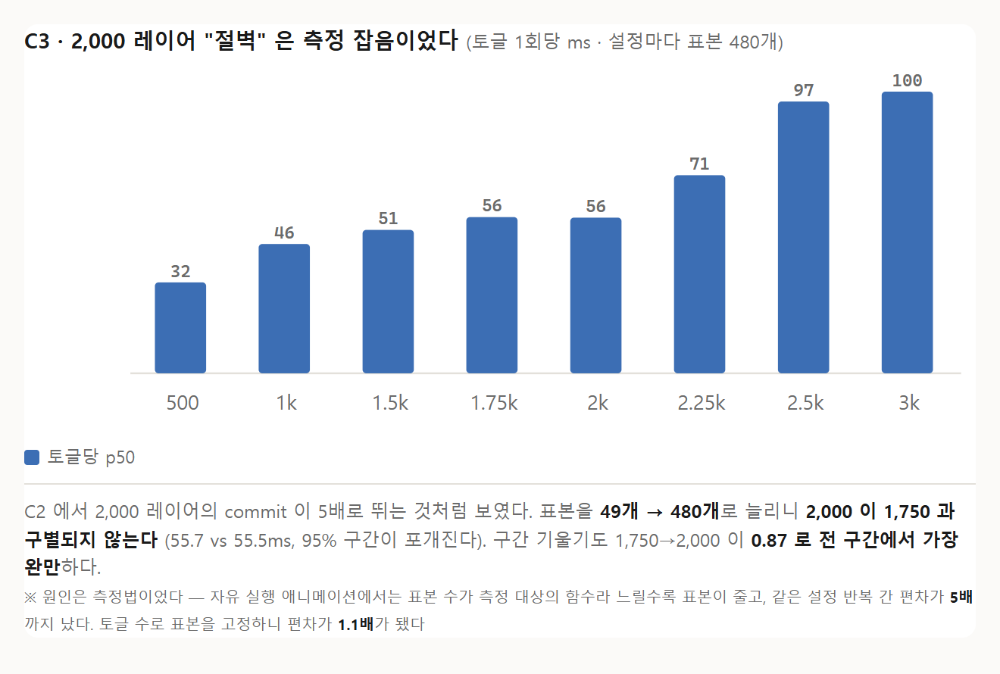

#### 먼저 산수 — 내가 적어둔 가설은 계산 한 줄로 죽는다

C2 에 *"[A2 의 타일 예산 512MB](#a2--합성-레이어의-gpu-메모리)와 관련일 수 있다"* 고 썼다.
[`kTileRoundUp = 64`](#a2--합성-레이어의-gpu-메모리) 로 38×15 박스는 64×64 타일 = **16KB**.

| 레이어 | 타일 메모리 | 512MB 예산 대비 |
|---:|---:|---:|
| **2,000** | **31.3 MB** | **6.1%** |

예산을 채우려면 **32,768개**가 필요하다. **측정하기 전에 계산부터 했어야 했다.**

#### 도구를 새로 만들어야 했다

C2 의 측정은 **표본 수가 측정 대상의 함수**였다 — 느릴수록 프레임이 적게 잡혀
2,000 레이어에서 3초에 **49개**뿐이었다. 그래서 표본 수를 내가 정하는 하네스를 만들었다.

```css
.box { transform: translateX(var(--tx, 0px)); will-change: transform }
```

`--tx` 를 한 번 바꾸면 레이어 N개가 전부 새 transform 을 받는다. **k번 토글하면 표본이 정확히 k개.**

| 측정 방식 | 같은 설정 반복 간 편차 |
|---|---:|
| C2 (자유 실행, 프레임 수가 표본 수) | **5.0배** |
| C3 (pump, 토글 수가 표본 수) | **1.1배** |

**C2 의 "절벽" 은 이 5배 편차 안에 들어간다.**

#### 결과 — 절벽이 있어야 할 자리가 가장 평평하다

구간 기울기 = 시간 배율 ÷ 레이어 배율. 1.0 이면 정확히 비례.

| 구간 | 기울기 | | 구간 | 기울기 |
|---|---:|---|---|---:|
| 500 → 1,000 | 0.71 | | 2,000 → 2,250 | 1.13 |
| 1,000 → 1,500 | 0.74 | | 2,250 → 2,500 | 1.24 |
| 1,500 → 1,750 | 0.93 | | 2,500 → 3,000 | 0.86 |
| **1,750 → 2,000** | **0.87** ← 절벽 자리 | | | |

2,000(55.5ms)은 1,750(55.7ms)과 **95% 구간이 포개진다.** 구별되지 않는다.

**타일 메모리를 3.6배로 늘려도** (박스를 100×100 으로 키워 128×128 타일) 절벽은 안 생긴다.
가장 많이 쓴 설정이 **133MB — 예산의 26%** 다.

#### 덤 — C2 가 판정 보류한 ③ 이 닫혔다

토글 1회를 단계별로 쪼개니 **commit 은 레이어당 14.4µs 로 일정**했다 (500~3,000, 6배 구간).

| 레이어 | 500 | 1,000 | 1,500 | 2,000 | 2,500 | 3,000 |
|---|---:|---:|---:|---:|---:|---:|
| **Commit 레이어당 µs** | 14.2 | 14.8 | 14.3 | 15.0 | 12.0 | 15.1 |
| Commit **개별 이벤트 중앙값** ms | 1.40 | 1.88 | 2.06 | **6.31** | 7.36 | 7.73 |

아랫줄이 C2 가 본 것이다 — 2,000 에서 3배로 뛴다.
차이는 **토글 하나에 Commit 이 몇 번 찍히느냐**이고, 그 횟수가 조건에 따라 변한다.

> **정해진 작업 단위로 합계를 내야 한다. 개별 이벤트의 분위수는 이벤트 개수가 변하면 같이 흔들린다.**
> C2 에서 세 방법 모두 R² 0.95 를 못 넘은 건 셋 다 이 함정에 걸려 있었기 때문이다.

**휘는 건 commit 이 아니라 Raster 다** — 1,000 → 1,500 에서 0.37ms → **40.70ms**. 기전은 미확인.

<sub>사전 등록 [PREDICTION.md](experiments/track-c/c3-layer-cliff/PREDICTION.md) · 전체 결과 [RESULTS.md](experiments/track-c/c3-layer-cliff/RESULTS.md) — 주장 4개 중 **4개 적중**</sub>

---

### C4 · Raster 110배는 내가 정한 2초였다

> **질문** — C3 이 *"Raster 가 1,000 → 1,500 에서 110배 뛴다, 기전 미확인"* 으로 닫았다. 무엇인가?

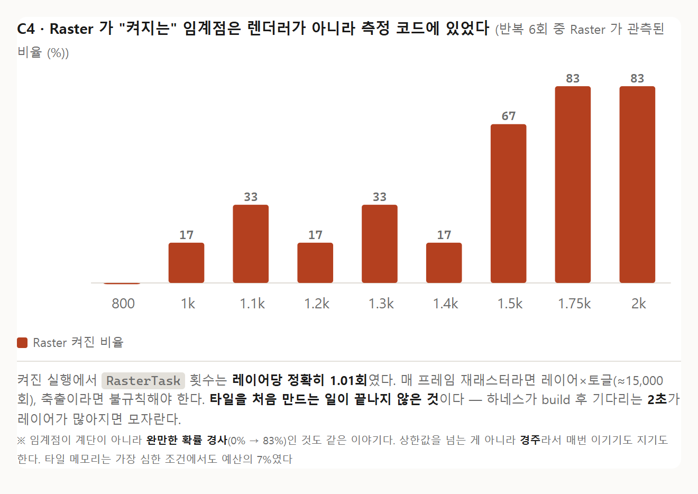

#### 먼저 — 110배는 평균이 만든 착시였다

C3 의 원자료를 **반복별로** 풀어보니 이렇게 생겼다.

| 레이어 | rep0 | rep1 | rep2 |
|---:|---:|---:|---:|
| 1,000 | 1.00 | 0.07 | 0.05 |
| **1,500** | **61.69** | **60.37** | **0.03** |
| 2,000 | 39.52 | 67.61 | 50.40 |

**중간값이 없다.** 0.05 아니면 60. 110배는 켜진 2회와 꺼진 1회를 평균낸 값이었다.

#### 소스에서 가설 두 개가 먼저 죽었다

| 가설 | 확인 | 결과 |
|---|---|---|
| 타일 **바이트** 상한 | 가장 심한 조건도 **512MB 중 7%** | ❌ |
| 타일 **리소스 개수** 상한 | `kDefaultNumResourcesLimit = **10,000,000**` | ❌ |

C3 을 쓰며 *"바이트 예산만 봤지 개수 상한은 확인해본 적이 없다"* 고 적어뒀던 걸 확인했다.
상한은 존재하지만 **1,000만 개**라 임계점(~1,100)과는 자릿수가 네 개 다르다.

#### 답 — 시간이 아니라 횟수를 셌더니 끝났다

| 레이어 | 상태 | **Raster 횟수** | 레이어당 | (레이어×토글)당 |
|---:|---|---:|---:|---:|
| 800 | 꺼짐 | **1** | 0.00 | 0.000 |
| 1,000 | 켜짐 | **1,003** | **1.00** | 0.067 |
| 1,100 | 켜짐 | **1,103** | **1.00** | 0.067 |

**레이어당 정확히 1회.** 이 한 줄이 후보를 전부 가른다.

| 가설 | 예상 횟수 | |
|---|---|---|
| 매 프레임 재래스터 | 레이어 × 토글 ≈ **15,000** | ❌ |
| 축출 후 재생성 | 1회보다 많고 불규칙 | ❌ |
| **초기 래스터가 안 끝난 것** | **레이어당 정확히 1회** | ✅ |

타일을 **처음 만드는 일**이 하네스가 기다리는 **2초** 안에 안 끝나서, 그 꼬리가 측정 창으로 넘어온 것이다.

#### 확인 — 레이어는 그대로, 기다린 시간만 바꿨다

레이어 **2,000 고정**, settle 만 바꿔 5회씩.

| settle | pump 구간 래스터 | **켜진 횟수** |
|---:|---:|---:|
| **1초** | 1,289ms / **1,407회** | **5/5** |
| 2초 | 78ms / 70회 | 1/5 |
| **4초** | 1ms / **1회** | **0/5** |
| 8초 | 6ms / 29회 | 0/5 |
| 16초 | 14ms / 67회 | 0/5 |

**같은 2,000 레이어인데 4초만 기다리면 래스터가 통째로 사라진다.**
초기 래스터 총량을 재보니 2,000 타일에 **1,395ms** — 2초는 아슬아슬한 값이었고, 그래서 갈렸다.

#### 임계점이 계단이 아니라 확률 경사인 것도 같은 이야기다

| 레이어 | 800 | 1,000 | 1,100 | 1,200 | 1,300 | 1,400 | 1,500 | 1,750 | 2,000 |
|---|---|---|---|---|---|---|---|---|---|
| 켜진 비율 | 0/6 | 1/6 | 2/6 | 1/6 | 2/6 | 1/6 | 4/6 | 5/6 | 5/6 |

사전 등록에 *"0 → 1 로 뾰족하게 뛴다"* 고 썼는데 **틀렸다.** 완만하게 오른다.
그런데 이 틀림이 답을 강화한다 — 상한값을 넘는 거라면 계단이어야 하고,
**경주**라면 매번 이기기도 지기도 하니 경사가 맞다.

> **"임계점" 은 렌더러가 아니라 내 측정 코드 안에 있었다.**

#### 사전 등록한 판별 하나는 "다시 설계" 분기로 갔다

레이어 개수는 그대로 두고 타일 1장의 바이트만 4배로 늘려봤는데, **한 번도 안 켜졌다.**

| 박스 | 1,000 레이어 | 1,400 레이어 |
|---|---:|---:|
| 38×15 (20KB/레이어) | **3/6** | 2/6 |
| 100×100 (76KB/레이어) | **0/6** | **0/6** (92.7MB) |

*"큰 박스가 서로 가려서 래스터를 건너뛴 것"* 이라고 짐작하고 재봤다 — **틀렸다.**
래스터 횟수가 1,374 vs 1,205 로 거의 같고, 100×100 쪽이 오히려 **더 오래** 걸린다(824 → 1,100ms).

#### 다시 보니 — 또 내 판정 기준이었다

`rasterPer`(ms) 말고 **`rasterN`(횟수)** 를 봤더니:

| 100×100 레이어 | rasterN 실측값들 |
|---:|---|
| 250 | **253, 253**, 1, 1, 1, 1 |
| 400 | 31, 1, 1, 1, **403**, 1 |
| 600 | 80, **603**, 1, 1, 1, 1 |

**253 / 403 / 603 — 레이어당 정확히 1회.** 위와 똑같은 서명이다. **새고 있었다.**
`rasterPer` 가 0.53~0.96ms 라 내가 정한 **5ms 기준**에 안 걸렸을 뿐이다.

> 바로 위에서 *"시간 말고 횟수를 세라"* 로 답을 얻어놓고,
> 정작 켜짐/꺼짐 **분류는 시간으로** 하고 있었다. **같은 실수를 한 섹션 안에서 두 번 했다.**

| 박스 | 타일당 래스터 비용 |
|---|---:|
| 38×15 (64×64 타일, 4,096px) | **131~497 µs** |
| 100×100 (128×128 타일, 16,384px) | **17~39 µs** |

*"100×100 은 절대 안 켜진다"* 는 현상 자체가 없었다. 켜지는데 시간 기준에 안 걸렸다.

#### 그 "10배" 도 재현되지 않았다 — 그리고 진짜 원인은 겹침이었다

레이어 600 고정, **글자 유무 × 박스 크기 × 겹침**으로 갈랐다.

| 조합 | 타일당 µs | p50 |
|---|---:|---:|
| 38×15 · 글자O · **겹침** | 779 | 487 |
| 100×100 · 글자O · **겹침** | **899** | 496 |
| 38×15 · 글자X · 겹침 | 515 | 247 |
| 100×100 · 글자X · 겹침 | 357 | 263 |
| **38×15 · 글자O · 안겹침** | **148** | **31** |
| **100×100 · 글자O · 안겹침** | **87** | **19** |

조건을 맞추니 100×100(899µs)이 38×15(779µs)보다 **오히려 조금 비싸다.**
§6.7 의 "10배" 는 레이어 수도 측정 창도 다른 둘을 나눈 값이었다 — **질문의 전제부터 틀렸다.**

**실제로 지배하는 건 겹침이다.**

| 무엇을 바꿨나 | 타일당 비용 |
|---|---|
| **겹침 제거** | **5.3~10.3배 싸짐** (p50 로는 16~26배) |
| 글자 제거 | 1.5~2.5배 |
| 면적 4배 | 0.87배 (거의 무관) |

#### 그런데 이 "겹침 10배" 도 잡음이었다

겹침을 불리언에서 **열 개수**로 바꿔 깊이를 연속으로 재보니 관계가 사라졌다.

| cols | 1 | 2 | 4 | 8 | 12 |
|---|---:|---:|---:|---:|---:|
| 겹침 깊이 | 600 | 300 | 150 | 56 | 50 |
| 타일당 µs | 582 | 773 | 467 | 628 | **967** |

`cols=12` 는 위 표의 "안겹침"과 **같은 설정**인데 87µs 가 아니라 **967µs** 다. **11배 차이.**

**왜 계속 이랬는지 — 같은 설정 반복의 흩어짐을 재보니 답이 나왔다.**

| | |
|---|---|
| 설정 **평균끼리의** 차이 | **2.1배** |
| 같은 설정 **안의** 흩어짐 | **최대 26배** (개별 반복 60~1,577µs) |

**잡음이 신호보다 12배 크다.** 그리고 원인은 GPU 래스터였다.

| | 타일당 µs | 반복 간 배율 |
|---|---:|---:|
| GPU 래스터 **켬** | 582 | **26.3배** |
| **GPU 래스터 끔** | 1,474 | **1.4배** |

소프트웨어 래스터는 느리지만 **안정적**이고, 겹침 효과도 없다(1,474 vs 1,395).

> **`RasterTask` 의 `dur` 은 GPU 래스터에서 "그리는 시간"의 지표가 아니다.**
> GPU 큐 대기가 섞여 있고, 그 대기가 작업보다 크고 변덕스럽다.
>
> §6.8 이 깔끔해 보인 건 조합을 **A→F 고정 순서**로 돌렸고 "안겹침"이 마지막 둘이었기 때문이다 —
> 세션 드리프트가 조건 차이로 보였다.

**무엇이 살아남나** — 이번 조사에서 **시간**으로 잰 건 전부 못 믿는다. **세어서** 잰 건 그대로다.

| 지표 | |
|---|---|
| `RasterTask` **횟수** (레이어당 1.00회) | ✅ 정수라 흔들릴 여지가 없다 |
| 발생 **시점** 분포 · **settle 판별** · 레이어 수 | ✅ 유효 |
| 타일당 **µs** 비교 전부 | ❌ 못 믿는다 |

**C4 의 주 결론은 전부 왼쪽 칸에 서 있다.** 무너지는 건 타일 비용 이야기뿐이다.

<sub>사전 등록 [PREDICTION.md](experiments/track-c/c4-raster-threshold/PREDICTION.md) · 전체 결과 [RESULTS.md](experiments/track-c/c4-raster-threshold/RESULTS.md)</sub>

---

## 통용되는 말 vs 실측

| 자주 듣는 말 | 실측 |
|---|---|
| "`transform` 을 쓰면 레이아웃·페인트를 건너뛴다" | ✅ 맞다 (Layout 32배, Paint 94배 감소) |
| "`transform` 은 메인 스레드를 안 쓴다" | ❌ Style·PrePaint·Commit 은 매 프레임 돈다. 요소가 많으면 그게 병목 |
| "`will-change` 를 쓰면 레이어로 승격된다" | ⚠️ CSS transform 애니메이션은 **이미 승격**돼 있어 아무 차이 없음 |
| "레이어는 공짜가 아니다" | ✅ 38×15 박스 하나가 **16KB** (실제 필요량의 7.2배) |
| "`content-visibility` 는 화면 밖을 공짜로 만든다" | ⚠️ **리레이아웃에서는** 여전히 O(N). **초기 로드에서는** 항목당 비용이 측정 한계 아래 |
| "`content-visibility` 는 layout 과 paint 를 건너뛴다" | ❌ **layout 은 오히려 늘어난다.** 이득은 거의 전부 **Style**(−71~76%, 무효화 종류와 무관). paint 는 원래도 컬링(14%) |
| "`content-visibility` 는 켜두면 손해 볼 일이 없다" | ❌ 세로로 밀기만 하는 변경에서는 레이아웃 패스가 **8회 → 17회**. 색만 바꿔도 **0회 → 9회** |
| "`contain-intrinsic-size` 의 `auto` 키워드가 성능을 좌우한다" | ❌ `auto 73px` 과 `73px` 의 차이가 **반복 편차보다 작다**(3~8%) |
| "`contain-intrinsic-size` 는 성능용" | ❌ **정확성용**. CPU 비용은 거의 같고, 없으면 스크롤바가 망가진다 |
| "레이어를 많이 만들면 어느 지점에서 급격히 나빠진다" | ❌ 3,000개까지 **불연속 없음**. commit 은 레이어당 14.4µs 로 선형 |
| "INP 200ms 를 통과하면 반응이 빠른 것" | ❌ 양보만 해도 통과한다. 사용자는 여전히 기다릴 수 있다 |

---

## 내가 틀렸던 것 12번

| # | 틀린 주장 | 어떻게 드러났나 | 정정 |
|---|---|---|---|
| 1 | "600개는 레이어 승격 한계를 넘어 거부됐을 것" | 개수 스윕 | **거부 없음.** 8000개까지 전부 승격 |
| 2 | "headless 는 GPU 가 없다" | A2 사전 검증(`SystemInfo.getInfo`) | **GPU 가속 켜져 있음** |
| 3 | "레이어 텍스처는 **2의 거듭제곱** 타일" | Chromium 소스 + 130×130 판별 실험 | **64의 배수로 올림** |
| 4 | "`content-visibility` 는 비용을 N과 무관하게 만든다" | N 스윕 | **여전히 O(N)** (21.4배) |
| 5 | "그러니 `content-visibility` 는 O(N)이라 별로다" | C1 초기 로드 측정 | **리레이아웃에 한한 이야기.** 초기 로드는 평탄하고 LCP 도 36~39% 빨라진다 |
| 6 | "`auto` 키워드의 기억값이 O(N)의 원인" | C2 직교 격자 | **`auto` 를 빼도 똑같다.** 원인은 무효화 종류였다 |
| 7 | "`content-visibility` 의 이득은 Layout 절감" | C2 무효화 3종 비교 | **Style 절감이다.** Layout 은 조건에 따라 늘어난다 |
| 8 | "Raster 가 1,500에서 110배 뛴다" | C4 반복별 분해 | **평균이 만든 착시.** 0.05 아니면 60, 중간이 없었다 |
| 9 | "임계점이면 켜진 비율이 0→1로 뾰족하게 뛴다" | C4 확률 측정 | **완만한 경사**(0%→83%). 상한 초과가 아니라 경주였다 |
| 10 | "100×100 은 타일당 비용이 10배 싸다" | C4b 조건 통제 | **재현 안 됨.** 조건 맞추면 오히려 조금 비싸다(899 vs 779µs) |
| 11 | "가림은 원인이 아니다" (횟수가 같으니까) | C4b 겹침 변수 | 기각이 틀렸다고 썼는데 — |
| 12 | "겹침이 타일 비용을 5~10배 바꾼다" | C4c 깊이 스윕 | **그것도 잡음.** 같은 설정 반복이 **26배** 흩어진다. 조건 차이는 2.1배뿐 |

### 폐기한 측정 방법 6번

| # | 폐기한 방법 | 이유 |
|---|---|---|
| 1 | 브라우저 패널에서 rAF 프레임 측정 | `document.hidden` 이면 rAF 가 **완전히 멈춘다.** 빈 배열을 정상 측정으로 착각할 뻔 |
| 2 | 스크린샷으로 컴포지터 동작 관찰 | `captureScreenshot` 도 **메인 스레드에 걸린다** (2,000ms 블록 중 1,936ms 지연) |
| 3 | 한 브라우저에서 GPU 메모리 연속 측정 | GPU 리소스 풀이 **이월**된다 (`left` 값이 소수점까지 동일) |
| 4 | 문서 전체를 40단계로 점프하는 "스크롤" | 21,786px 점프는 스크롤이 아니다. **결론이 정반대로 뒤집혔다** |
| 5 | settle 구간에도 트레이싱을 켜둔 판별 도구 | 20만 이벤트 **전송 시간이 settle 에 몰래 더해진다.** "1초 settle" 이 실제로는 수 초였다 |
| 6 | **GPU 래스터에서 `RasterTask.dur` 로 비용 비교** | 같은 설정 반복이 **26배** 흩어진다. GPU 큐 대기가 섞여 있다. 소프트웨어 래스터는 1.4배 |

---

## 방법론 18조

거의 전부 **틀리고 나서** 얻은 것들이다.

<table>
<tr><td valign="top" width="33%">

**측정하기 전에**

1. 성공 기준을 **파일로 먼저** 쓴다
2. 계측기가 **메인 스레드에 걸리는지** 먼저 확인한다
3. **가설들이 갈리는 표본**을 고른다

</td><td valign="top" width="33%">

**측정할 때**

4. "몇 배 빠른가"가 아니라 **"어떤 이벤트가 몇 번 도는가"**
5. **N을 스윕**한다
6. **대조군도 같이 스케일링**한다
7. **아무것도 안 하는 대조군**을 둔다
8. **프로세스를 격리**한다
9. 반복하고 **rep 0 을 의심**한다

</td><td valign="top" width="33%">

**결과를 볼 때**

10. **소수점까지 같은 값**이 반복되면 의심한다
11. **측정 조건이 현실적인지** 되묻는다
12. **소스를 확인**한다
13. **표본 수를 내가 정한다** — 표본 수가 측정 대상의 함수면 안 된다
14. **평균 전에 반복별 값**을 본다
15. **시간 전에 횟수**를 센다
16. **내가 정한 상수**를 변수로 바꿔본다
17. **조건 차이를 말하기 전에** 같은 조건 반복의 흩어짐부터 잰다
18. 조건 **순서를 섞는다**

</td></tr>
</table>

> 2번이 이 프로젝트에서 **두 번** 나를 구했다 (A1 스크린샷 · A5 rAF 콜백).
> 1번은 A4에서 값어치를 증명했다 — "5배 미만"을 미리 못 박아두지 않았다면 21.4배를 보고도 *"그래도 7.8배 빨라졌네"* 로 넘어갔을 것이다.

**13~16번은 Track C 에서 붙었다.** 전부 *"발견인 줄 알았던 게 내 측정 도구였다"* 는 경험에서 나왔다.

| # | 어디서 얻었나 |
|---|---|
| 13 | [C3](#c3--2000-레이어-절벽-은-측정-잡음이었다) — 자유 실행 애니메이션은 느릴수록 표본이 줄어, 반복 간 편차가 **5배**였다. 찾으려던 신호와 같은 크기 |
| 14 | [C4](#c4--raster-110배는-내가-정한-2초였다) — "110배 점프"는 **평균이 만든 착시**였다. 반복별로 보니 0.03 아니면 60, 중간이 없었다 |
| 15 | [C4](#c4--raster-110배는-내가-정한-2초였다) — `RasterTask` **횟수**가 레이어당 정확히 1.00회. 이 한 줄이 축출·재래스터·초기래스터를 한 번에 갈랐다 |
| 16 | [C4](#c4--raster-110배는-내가-정한-2초였다) — 하네스가 기다리는 **2초**를 변수로 바꾸자 "임계점"이 사라졌다 |
| 17 | [C4c](#c4--raster-110배는-내가-정한-2초였다) — 타일당 µs 를 **네 번** 결론으로 썼다가 전부 뒤집었다. 같은 설정 반복이 **26배** 흩어지는데 조건 차이는 2.1배였다 |
| 18 | [C4b](#c4--raster-110배는-내가-정한-2초였다) — 조합을 A→F **고정 순서**로 돌렸더니 세션 드리프트가 조건 차이로 보였다 |

> 15번은 C4 안에서 **두 번** 필요했다. 횟수를 세서 답을 얻어놓고도 켜짐/꺼짐 **분류는 시간으로** 하고 있었고,
> 그것 때문에 "100×100 은 안 켜진다" 는 없는 현상을 한참 쫓았다.

---

## 재현하기

### 필요한 것

| | |
|---|---|
| Node.js | 22+ (내장 `WebSocket` 사용, 의존성 0개) |
| Chrome | 헤드리스 + `--remote-debugging-port` |
| Python | 정적 서버용 (`http.server`) |
| ffmpeg | GIF 생성 시에만 |

### 실행

```bash
# 1) 정적 서버 (프로젝트 루트에서)
python -m http.server 8765 --bind 127.0.0.1
```

```bash
# 2) 실험 — 각 디렉터리에서
cd experiments/track-a/a1-pipeline-skip
node trace-bench.mjs --boxes=5          # 단계별 이벤트 카운트
node s4-trace.mjs --boxes=1             # 메인 블로킹 중 컴포지터 활동
node sweep.mjs                          # 박스 개수 스윕

cd ../a2-gpu-memory
node probe.mjs                          # ① 계측기 사전 검증 (필수)
node sweep-isolated.mjs --counts=1000,4000 --repeat=3
node sweep-isolated.mjs --counts=4000 --sizes=38x15,100x100,200x200 --repeat=3

cd ../a3-paint-chunks   && node measure.mjs --repeat=3
cd ../a4-content-visibility
node measure.mjs --counts=100,500,2000,8000 --repeat=3          # 리레이아웃
node measure.mjs --phase=scroll2 --counts=8000 --repeat=3       # 연속 스크롤
cd ../a5-inp-loaf       && node measure.mjs --clicks=12 --work=200 --repeat=3
```

```bash
# 3) 리포트 재생성 (원자료 → 대시보드 → 이미지)
cd report
node build-report.mjs
node shoot.mjs
node record.mjs "http://127.0.0.1:8765/report/demo-thread.html" "demo-main-thread-block" --sec=8
```

각 실험 하네스는 브라우저에서 **직접 열어 조작**할 수도 있다. 콘솔에서:

```js
__A1.setMode('transform'); __A1.setCount(600); __A1.blockMain(1500)
__A3.setScenario('s5-interleaved')
__A4.build(2000, 'cv-exact'); await __A4.scrollLinear(300, 60)
__A5.setStrategy('paint-first+yield')
```

---

## 파일 구조

```
.
├── README.md                          ← 이 문서
├── docs/
│   ├── README.md                      인덱스 · 강의 커버리지 맵
│   ├── 01-landscape-2026.md           2026 기술 지형 조사
│   ├── 02-experiment-tracks.md        실험 트랙 후보 A~D
│   ├── 03-track-a-synthesis.md        Track A 종합 · 방법론 12조
│   ├── lecture/
│   │   ├── 01-rendering-pipeline.md   강의 + 슬라이드 8장 매칭
│   │   └── 02-javascript-and-rendering.md
│   └── video/
│       └── 01-life-of-a-pixel-2020.md 자막 전문 + 슬라이드 46장 판독
│
├── demos/                             ← 인터랙티브 데모 10선
│   ├── index.html                     목록 페이지
│   ├── lib/                           공용 CSS·JS
│   └── 01-pipeline/ … 10-invalidation/
│
├── experiments/track-a/
│   ├── a1-pipeline-skip/        index.html · 5개 스크립트 · RESULTS ×2
│   ├── a2-gpu-memory/           PREDICTION · probe · sweep-isolated · RESULTS ×2
│   ├── a3-paint-chunks/         PREDICTION · index.html · measure · RESULTS
│   ├── a4-content-visibility/   PREDICTION ×2 · index.html · measure · RESULTS ×2
│   └── a5-inp-loaf/             PREDICTION · index.html · measure · RESULTS
│
├── experiments/track-c/               ← Track A 의 결론을 되짚는다
│   ├── c1-initial-load/         PREDICTION · gen(정적 페이지 9종) · measure · RESULTS
│   ├── c2-anomalies/            PREDICTION · index.html · measure · analyze
│   │                            probe-layers · probe-commit · probe-harness · RESULTS
│   ├── c3-layer-cliff/          PREDICTION · index.html(pump) · measure · analyze
│   │                            probe-stages · probe-buffer · RESULTS
│   └── c4-raster-threshold/     PREDICTION ×3 · measure · probe-settle · probe-why
│                                probe-occlusion · probe-tilecost · probe-overlap · RESULTS
│
└── report/
    ├── build-report.mjs         원자료 JSON → 대시보드 HTML
    ├── shoot.mjs                CDP 스크린샷
    ├── record.mjs               CDP screencast → ffmpeg → GIF
    ├── diagram-pipeline.html    파이프라인 다이어그램
    ├── demo-thread.html         메인 블로킹 데모
    └── images/                  PNG 27 · GIF 5
```

**문서 29 · 데모 10 · 하네스 8 · 스크립트 24 · 원자료 JSON 24 · 이미지 32(GIF 5 포함)**

---

## 참고 자료

### 1차 출처 (조사에서 가장 많이 쓴 것)

| 자료 | 비고 |
|---|---|
| [RenderingNG 자료구조](https://developer.chrome.com/docs/chromium/renderingng-data-structures) | 밀도가 가장 높다. immutable fragment tree · property trees · paint chunk |
| [RenderingNG 아키텍처](https://developer.chrome.com/docs/chromium/renderingng-architecture) | 13단계 · 3프로세스 · 6스레드 |
| [BlinkNG deep-dive](https://developer.chrome.com/docs/chromium/blinkng) | |
| [How cc Works](https://chromium.googlesource.com/chromium/src/+/master/docs/how_cc_works.md) | 컴포지터 내부 |
| [dbaron, How browser rendering works](https://dbaron.github.io/browser-rendering/) | Gecko 관점 |
| [Skia Graphite 소개](https://blog.google/chromium/introducing-skia-graphite-chromes/) | Ganesh → Graphite |
| [Interop 2026](https://web.dev/blog/interop-2026) | |
| [LoAF API](https://developer.chrome.com/docs/web-platform/long-animation-frames) | |

### 영상

| 영상 | 비고 |
|---|---|
| [**Life of a Pixel** (Chrome University 2020)](https://www.youtube.com/watch?v=PwYxv-43iM4) | 이 저장소에서 **자막 전문 + 슬라이드 46장** 분석 → [정리](docs/video/01-life-of-a-pixel-2020.md) |
| [Life of a Pixel 슬라이드](https://docs.google.com/presentation/d/1boPxbgNrTU0ddsc144rcXayGA_WF53k96imRH8Mp34Y) | 계속 갱신되는 원본 |
| [Ladybird: State of the Union (2026-06)](https://www.youtube.com/watch?v=gZL3uk7oa2g) | |
| [Ladybird Is In For A Rusty Future (2026-03)](https://www.youtube.com/watch?v=fXnuR6nXJzc) | C++ → Rust 이식 |
| [BlinkOn 채널](https://www.youtube.com/user/blinkontalks) · [Chromium University](https://www.youtube.com/playlist?list=PL9ioqAuyl6ULp1f36EEjIN1vSBEfsb-0a) | |

### 소스에서 직접 확인한 것

| 파일 | 확인한 내용 |
|---|---|
| [`cc/layers/tile_size_calculator.cc`](https://chromium.googlesource.com/chromium/src/+/main/cc/layers/tile_size_calculator.cc) | `kTileRoundUp = 64` · GPU 래스터의 `default_tile_size` 유도 |
| [`third_party/blink/.../layer_tree_settings.cc`](https://chromium.googlesource.com/chromium/src/+/main/third_party/blink/renderer/platform/widget/compositing/layer_tree_settings.cc) | `kDefaultMemoryMB = 512` · 플랫폼별 예산 |
| `.../graphics/paint/paint_artifact.cc` | `ToJSON()` 은 있으나 **테스트 빌드 전용** — 릴리스 Chrome 에서 접근 불가 확인 |

### 엔진 저장소

| 리포 | ★ | 메모 |
|---|---:|---|
| [LadybirdBrowser/ladybird](https://github.com/LadybirdBrowser/ladybird) | 66.2k | **학습용 1순위.** 읽을 수 있는 크기의 진짜 엔진 |
| [servo/servo](https://github.com/servo/servo) | 38.0k | Rust, 임베딩 가능, 월간 릴리스 |
| [chromium/chromium](https://github.com/chromium/chromium) | 24.8k | `third_party/blink` · `cc` · `components/viz` |
| [WebKit/WebKit](https://github.com/WebKit/WebKit) | 10.2k | 레이아웃 엔진 재작성 실황 |
| [google/skia](https://github.com/google/skia) | 10.9k | Ganesh + Graphite |
| [DioxusLabs/blitz](https://github.com/DioxusLabs/blitz) | 4.2k | 모듈형 HTML/CSS 렌더러 — 실험 최적 |
| [linebender/vello](https://github.com/linebender/vello) | 4.3k | GPU compute 2D 렌더러 |

> 전체 목록과 2026년 엔진별 현황은 [docs/01-landscape-2026.md](docs/01-landscape-2026.md) 에 있다.

---

## 닫지 못한 것

| 항목 | 상태 |
|---|---|
| **paint chunk 직접 계수** | ❌ **불가능 확인.** `internals.layerTreeAsText()` 는 테스트 빌드 전용. 소스 빌드 필요 |
| `content-visibility` 의 **초기 로드** 비용 | ✅ **닫음** → [C1](#c1--a4-의-결론은-절반만-맞았다). Layout 평탄, LCP 36~39% 단축 |
| `auto` 키워드가 O(N) 의 원인인가 | ✅ **닫음** → [C2](#c2--같은-css-가-조건에-따라-손해를-본다). **아니다** (차이 3~8%) |
| **commit 이 레이어 수에 선형인가** | ✅ **닫음** → [C3](#c3--2000-레이어-절벽-은-측정-잡음이었다). **레이어당 14.4µs, 임계점 없음** |
| 2,000 레이어에서 commit 이 5배 뛰는 이유 | ✅ **닫음** → [C3](#c3--2000-레이어-절벽-은-측정-잡음이었다). **절벽 자체가 없었다** (표본 49개짜리 잡음) |
| **Raster 가 1,000→1,500 에서 110배 뛰는 기전** | ✅ **닫음** → [C4](#c4--raster-110배는-내가-정한-2초였다). **초기 래스터가 내 2초 settle 안에 안 끝난 것** |
| GPU 메모리 압박이 관여하는가 | ❌ 미검증. 값은 기록했지만(32→74MB) 판별 실험은 안 했다 |
| ~~큰 박스(100×100)는 왜 한 번도 안 켜지나~~ | ✅ **닫음** — 현상 자체가 없었다. 내 **5ms 시간 기준**에 안 걸린 것 |
| ~~겹침이 왜 타일당 비용을 10배로 만드나~~ | ✅ **닫음** — 10배 자체가 잡음이었다. 잡음이 신호보다 12배 크다 |
| **GPU 래스터에서 `dur` 이 왜 26배 널뛰나** | ❌ 미확인. GPU 큐 대기로 보이지만 직접 재진 않았다 |
| pump 로도 남는 **세션 간 1.3배 편차** | ❌ 미확인. 반복 간은 1.1배로 잡혔는데 실행을 바꾸면 벌어진다 |
| `:root` 커스텀 프로퍼티가 아닌 무효화로 재측정 | ❌ 미측정. 지금 Style 절대값은 최악 경우로 부풀려져 있다 |
| 점프형 스크롤에서 정확한 intrinsic-size 가 느려지는 기전 | ❌ 미확인 (`Paint` 97 → 1,315 이 단서) |
| 실제 휠·터치 스크롤 | ❌ JS `scrollTop` 대입으로 대체 |
| Skia **Graphite** 경로 | ❌ 이 환경은 `skia_graphite: disabled_off` (Ganesh) |
| Safari · Firefox 대조 | ❌ 전부 Chrome 152 단일 엔진 |

---

<div align="center">
<sub>측정 환경: Chrome 152.0.7977.83 (headless=new, GPU 가속) · RTX 4050 Laptop / Intel Iris Xe · Windows 11 · 2026-09-17</sub>
</div>
